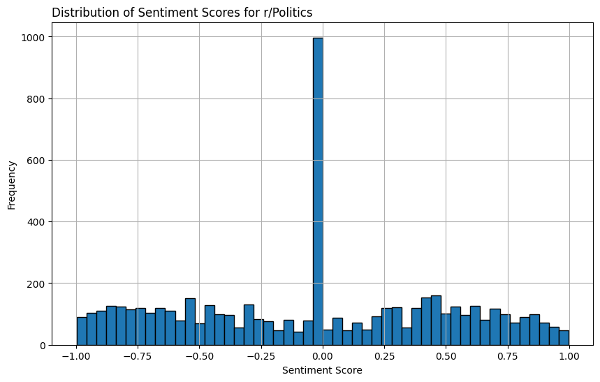
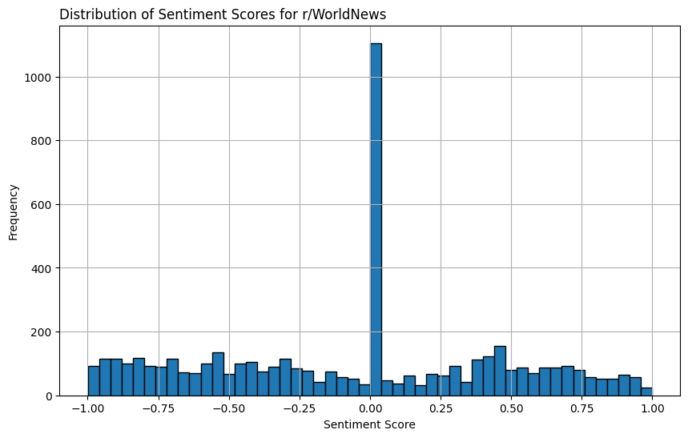
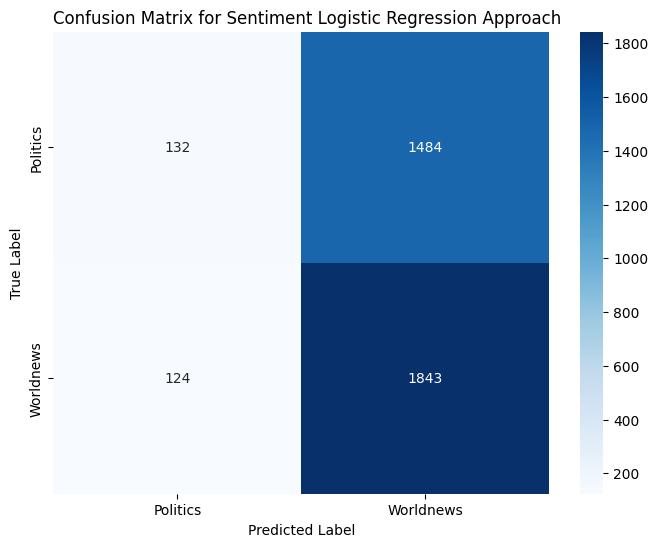
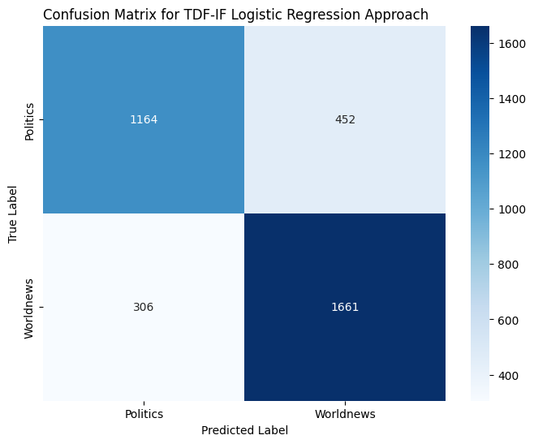
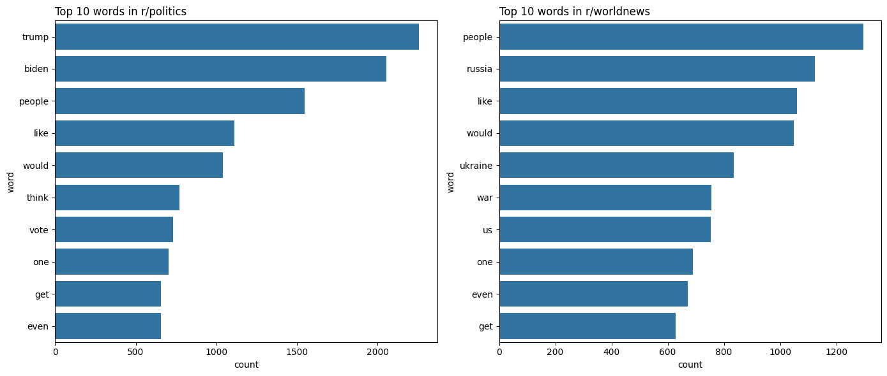

# Distinguishing Reddit Users by Subreddit

### by Connor Finnerty

## Clearing the Fog of Flame Wars Started by Those Whose Homes are at No Risk of Burning Down

While the Internet has lead to the world population becoming ever-more interconnected, the anonymity it provides has caused a decline in social trust. Much of this decline has been attributed to antisocial behavior: twisted insults, hateful rhetoric, coordinated bullying, and doxxing. One overlooked element of anonymity, however, is the fact that people no longer know whether people engaging in discussions of politics and current affairs are members of their own society. Discussion of politics has not just become nationalized, it has become globalized.

I don't mean to imply that foreigners have no right to engage in discourse regarding another country's politics. International trade, mutual defense pacts, inter-state resouce competetion, and violent conflict represent domains where decisions made by one state can affect another's people, and should be open to discussion by affected, effecting, and disinterested parties. Consequently, knowing a particular commenter's country or origin represents important contextualizing information, whereby a given commenter's epistemic standpoint may be assessed.

Reddit is the world's 18th largest website, and one of the most intense sites of in-depth political discussion. Reddit's upvote system naturally rewards user engagement, promoting detailed discussion between commenters' viewpoints. Two of the largest subreddits, r/Politics (approx. 8.5mil subscribers)  and r/WorldNews (approx. 38mil), are dedicated to dicussion of highly contentious current events. One of the challenges that Reddit presents to non-US users, as a website used primarily by those with US IP addresses (51.5%), is that the US perspective on global affairs tends to drown out voices of those with greater stakes and more intimate relationships to the affairs of non-US countries.

r/Politics, as a subreddit dedicated almost exclusively to US news, gives us an opportunity to filter out American voices in favor of those of non-US origin from discussion of r/WorldNews. By creating a TDF-IF vectorizer model, I hope to develop a preliminary classification method capable of distingushing between the topics and concepts typically employed by US users, so that the sentiments of non-US users may be brought to the forefront.

---

### Data Collection and Data Cleaning

Data for this project was gathered using the Python Reddit API Wrapper (PRAW). By exploring the PRAW documentation, I was able to develop a method of scraping every comment made on the top posts over a given timeframe. Due to complications (Reddit deleted/hid all comments for discussion pertaining to the Presidential Debate, which constituted a large percentage of posts during many of the time periods I was scraping). To create a balanced set, I scraped the top 30 posts for both r/Politics and r/WorldNews for the prior week.

Once that was completed, I:

- cleaned each comment
- generated a .csv sheet for each post
- colated all 30 .csv sheets as Excel sheets in a single Excel file dedicated to each subreddit (for both r/Politics and r/WorldNews)

---

### EDA and Preprocessing

- Unpacked each sheet in both Excel files
- Performed sentiment analysis and generated sentiment scores for each post's comment section (Excel sheet)
- Appended sentiment scores to each sheet
- visualized comment scores
- eliminated irrelevant comments based on scores (those between -5 and 5)
- plotted histogram of sentiment scores for each Excel file

Sentiment Scores for r/Politics

Sentiment Scores for r/WorldNews

---

## Modeling

- First attempt was to use a Logistic Regression to see whether sentiment scores could be used to classify an r/Poltics user vs r/WorldNews user
- Yielded poor results

- Moved on to Logistic Regression with TDF-IF

- compared the results to a Support Vector Classifer with TDF-IF

## Evaluation

For this analysis, I was surprised to see that sentiment scores were not a particularly useful tool for distinguishing between the two comment sections. I was not surprised, however, to see that TDF-IF vectorizer was much more effective at distingushing commenters, given that the topics of discussion would likely easily differentiated by the most commonly used words.

Since the TDF-IF columns were numerous and simple, I was also not surprised that a Logsistic Regressor performed about as well as a much more powerful technique, the SVM.

## Conclusion and recommendations

Users need to be given more information about the content they see online. This need scales proportionally with the importance and salience of the information in question. By creating NLP models that analyze content that people see on social media, users can become more grounded in their understanding of the sources and biases underlying the content they consume, allowing it to be properly contextualized before it's stored in their worldview schema. By creating a model that does a decent job of classifying r/Politics and r/WorldNews users, it gives promise to the idea that users can be made aware of the national origin of various forms of online discourse, so that they may understand why information they are unfamiliar with is being presented, and why particular rhetorical and conceptual techniques are being used. I will continue to work on this project and see if I can make a basic application that allows a user to examine a comment and see a visual of that commenter's likely country of origin based on their comment history.

| Data | Source | Description |
|------|--------|-------------|
| Reddit User Political Spectrum | https://www.statista.com/statistics/517259/reddit-user-distribution-usa-political-spectrum/
 | Bar chart showing Reddit User political views vs general population |
| Reddit Traffic by Country | https://www.reddit.com/r/dataisbeautiful/comments/phhu9s/oc_reddit_traffic_by_country/
 | Bar plot made by Reddit user showing reddit users by country |
| Reddit background info | https://www.inc.com/christine-lagorio/reddit-whole-team-here.html | Article detailing information about Reddit and its history |
| Quantifying gender biases towards politicians on Reddit | https://pubmed.ncbi.nlm.nih.gov/36288326/ | Study characterizing political biases on Reddit towards female politicians |
| The Effect of Attitude, Social Trust and Trust in Social Networking Sites on Two Dimensions of Sharing Behavior | https://aisel.aisnet.org/amcis2012/proceedings/SocialIssues/11/ | Examining online content sharing behavior of Social Media Users |
| Civility and Trust in Social Media | https://www.sciencedirect.com/science/article/abs/pii/S0167268119300563 | Study examining the relationship between online civility and user social trust |

